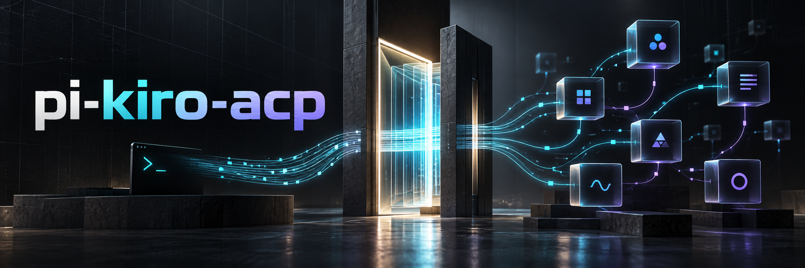

**Pi + Kiro, one coding workspace.** An ACP integration with local tools, session controls and a usage dashboard.

- **Connected workflow** — Pi tools, with optional Fabric workers and Fovea context.
- **Visible activity** — reported credits, token counts and session history.
- **Private setup** — a unique local installation ID, preserved across updates and excluded from Git and packages.

## Get started

Requires **Node.js 22.16+**, **Pi**, and **Kiro CLI with ACP support**. Compiled files are included.

```sh
git clone https://github.com/asx8678/pi-kiro-acp.git
cd pi-kiro-acp
kiro-cli login
node dist/src/cli.js init --experimental
node scripts/install-pi.mjs
node dist/src/cli.js doctor
pi
```

Already configured? Skip `init`. To update, pull the latest code, rerun the installer and restart Pi.

## Inside Pi

| Command | Action |
|---|---|
| `/model` | Select a Kiro entry |
| `/usage` | Open the credit and activity dashboard |
| `/kiro doctor` | Check the connection |
| `/kiro status` | Inspect session status |
| `/kiro cancel` | Cancel active work |

[Configuration](docs/operations.md) · [Privacy](SECURITY.md) · [Compatibility](docs/compatibility.md) · [Development & tests](docs/testing.md)

*Experimental · [MIT license](LICENSE) · Independent community project*
